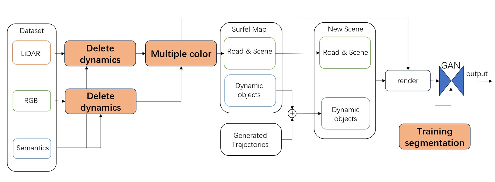

# Research projects

### Can large language model understand graph structure?

Above image from NLGraph, demonstrates one of the prompts used to test LLM to solve graph problems. Deeping further in this task, we have found that hallucination of LLM may misled previous works.

### Autonomous driving scene generation

To enhance the realism and diversity of autonomous driving simulations, we employ a novel variation of surfels to reconstruct real-world scenes
and generate dynamic situations. In addition to scene reconstruction and our self-implemented surfel renderer, we utilize a Generative Adversarial
Network (GAN) to improve simulation outcomes.

