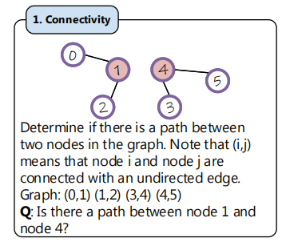
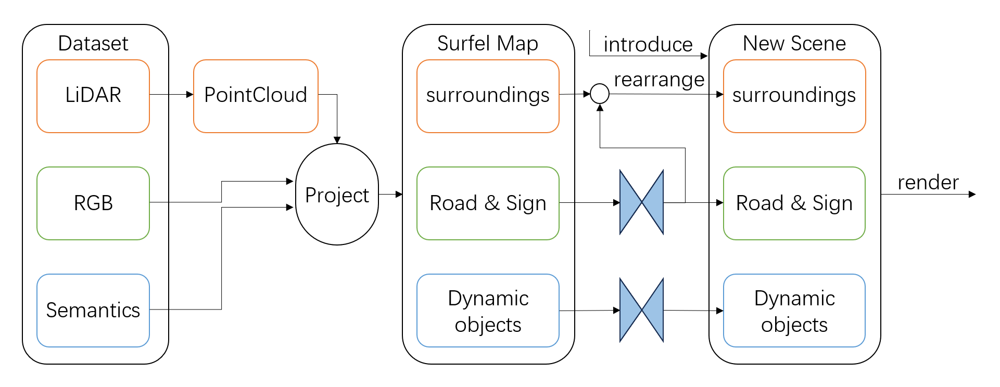
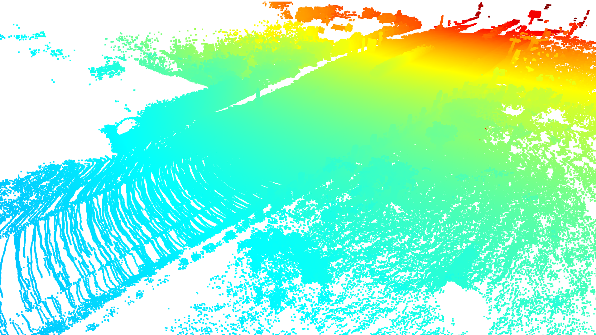
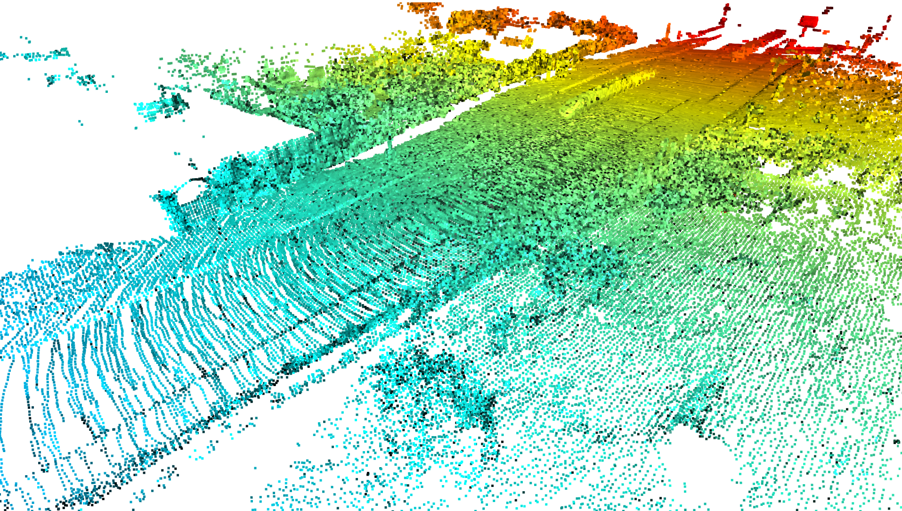
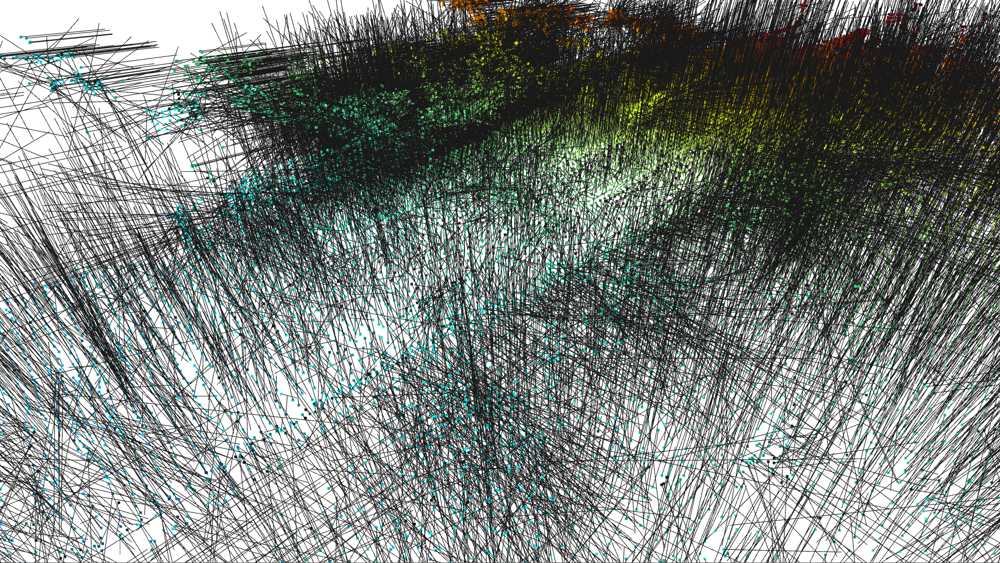

# Interested Fields

### can large language model understand graph structure?

Above image from NLGraph, demonstrates one of the prompts used to test LLM to solve graph problems. Deeping further in this task, we have found that hallucination of LLM may misled previous works.

### autonomous driving scene generation

